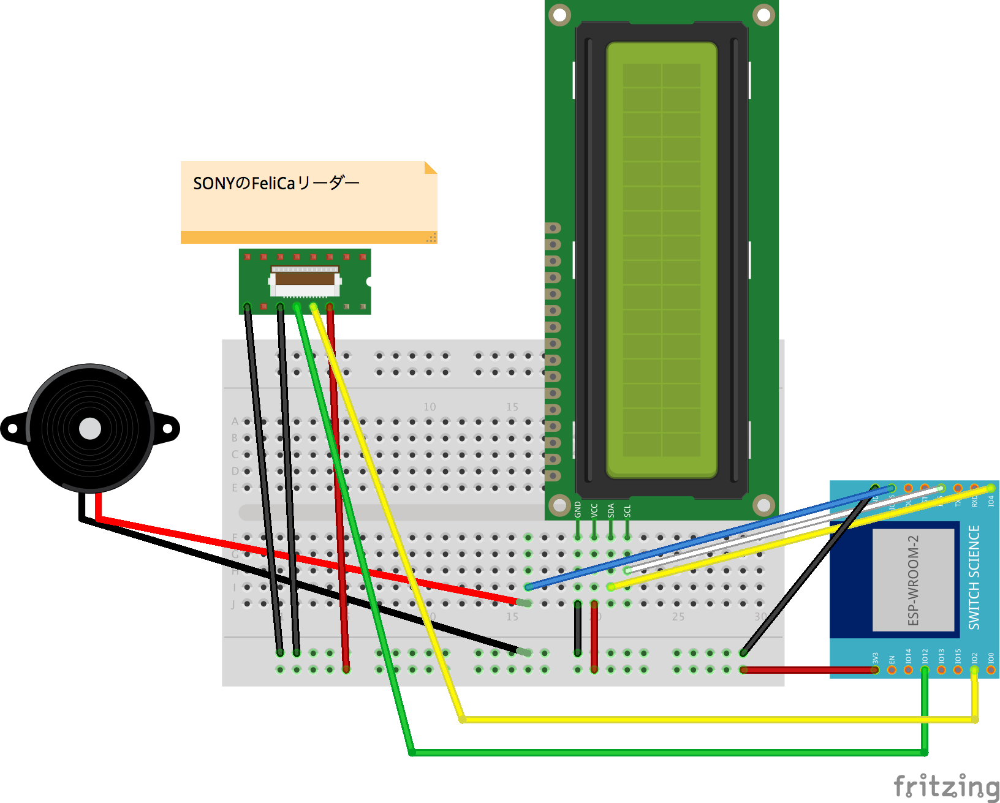

# dakoku-board

これは勤怠の出社/退社をサーバーに送信するためのマイコンボードプログラムです。

## ハードウェア

- [ESPr Developer](https://www.switch-science.com/catalog/2500/)
- [FeliCa リーダー・ライター RC-S620S](https://www.switch-science.com/catalog/353/)
- [FeliCa Plug ピッチ変換基板](https://www.switch-science.com/catalog/1030/)
- [I2C接続の小型LCD搭載ボード(3.3V版)](https://www.switch-science.com/catalog/1405/)

## 開発環境

- Arduino IDE 1.6.12 以上
- Fritzing

## 回路イメージ

- 8x2 のLCD部品がなかったので、 16x2 の部品を使っています
- FeliCa Plug ピッチ変換基板 もなかったので、一般のFCCコネクタ部品を使っています

## 環境設定

`config.h.example` を `config.h` にコピーして、WIFIの設定を変更してください。

## TODO

WiFi環境でない場所でも使えるように、[Wio LTE](https://soracom.jp/products/wio_lte/) でも利用可能にする
